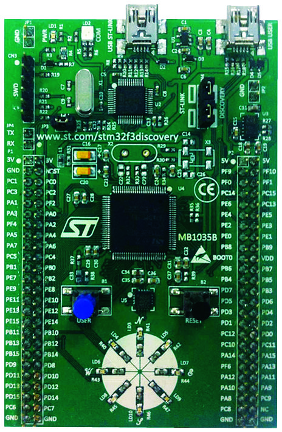

class: branded-adc20

???
* Thank you for the introduction Timour
* I'm grateful for the opportunity to be talking at ADC20 tonight!


####Remember

* One topic per slide
* Remember to pause. A. LOT.
* This is just a primer, not a year-course.

####keys

* h or ?: Toggle the help window
* j: Jump to next slide
* k: Jump to previous slide
* b: Toggle blackout mode
* m: Toggle mirrored mode.
* c: Create a clone presentation on a new window
* p: Toggle PresenterMode
* f: Toggle Fullscreen
* t: Reset presentation timer
* <number> + <Return>: Jump to slide <number>

---

class: center, middle

## about me

.bigger[]

???
* Good evening
* My name is Antoine
* I'm from Cape Town, South Africa
* I'm a musician and self-taught engineer who likes to make stuff.
* About 5 years ago my kids hit their late teens.
* Some people would use that as their cue to buy a sports car but I got myself a nice oscilloscope instead
* This was the beginning of flowdsp.io
* Done a lot of R&D towards building hybrid analog/digital music hardware
* But tonight I'd specifically like to talk about the impact Rust is having on the digital / embedded development side

####ObDisclaimer

Embedded Rust is a really big topic with some pretty unique angles and I don't have a lot of time!

* I've had to think carefully about what to cover and what not.
* So I'm probably gloss over or leave out one of your favorite bits.
* For this I do apologize in advance and thank you for your patience!

---

class: center, middle

## ADC18: Ian Hobson - An Introduction To Rust For Audio Developers
### [https://www.youtube.com/watch?v=Yom9E-67bdI](https://www.youtube.com/watch?v=Yom9E-67bdI)


<p/><br/>

## ADC20: Tom Waldron - Hitchhiker's Guide To Embedded Audio
### [https://audio.dev/talks/hitchhikers-guide-to-embedded-audio](https://audio.dev/talks/hitchhikers-guide-to-embedded-audio)

???
Ian's talk was in many ways the genesis of this talk.


* Specifically, if you're looking for a talk which does a deep dive on the Rust Language: Ian
* If you're looking for a talk which does a deep dive on embedded topics: Check out Tom tommorrow night


---

# Part 1: Meet The Hardware

---

## Why use a MCU instead of a SBC?

--

After all...

.float-left.normal-fixed[
<center></center>
* 34 Euro
* 4x cores @ 1.5 GHz
* 2GB SDRAM
* 32GB Flash
* Thriving community
]

--

.float-right.normal-fixed[
<center></center>
* 48 Euro
* 1x core @ 48 MHz
* 32KB SRAM
* 256KB Flash
]


???

After all, why buy a Raspberry Pi?

...when you can have the fastest Arduino in the world!

* Raspberry Pi 4 costs 34,60280 € has 4x cores @ 1.5 GHz, 2GB SDRAM and as much flash as you can fit into a micro-sd slot.

* Arduino Zero costs 48 euro (US$42.90) for a single 32-bit core running @ 48 MHz, 32KB SRAM and 256 KB Flash.

---

## Reason 1: not everyone needs to be a super-computer

.big[]


???
Seriously, I used to develop bioinformatics algorithms for supercomputers that had less processing power!

* Thea Flowers - Big hunking button, Microchip/Atmel SAM D21 @ 48 MHz
  * https://blog.thea.codes/designing-big-honking-button/
* émilie gillet - Braids, STM32F103 @ 72 MHz, no codec even
  * https://github.com/pichenettes/eurorack
* Peter Kirn - Meeblip, Microchip/Atmel ATMEGA32 AVR, 8-bit 16 MHz !
  * https://github.com/meeblip
* Robert Manzke, Phillip Lamp, Niklas Wantrupp - CTAG Strampler
  * https://github.com/ctag-fh-kiel/ctag-straempler/
* Matt Heins - Vectr, PIC32MX430 @ 100 MHz + MGC3130
  * https://github.com/hackmeopen/Vectr

---

## Reason 2: development cost

* BGA packages are a real pain to solder

.float-left[

]

--

.float-right[
.bigger[]
]

--

* High-speed digital design gurus are hard to find and require special care and feeding

--

* Circuit complexity increases non-linearly relative to processor power


---

## Reason 2: bom cost

<p/><br/>

.halfway[
| Processor  | Min qty: 1 | Min qty: 1000 |            |
|------------|------------|---------------|------------|
| i.MX8      | 24 Euro    | 16 Euro       | 4x 1.5 GHz |
| i.MXRT1062 | 9.50 Euro  |  6 Euro       | 1x 600 MHz |
| STM32H750  | 7 Euro     |  3.50 Euro    | 1x 480 MHz |
| STM32F103  | 3.50 Euro  |  2 Euro       | 1x  72 MHz |
| ESP32      | 2.36 Euro  | No minimum    | 2x 240 MHz |
]


???
NXP i.MX8 is roughly equivalent to RPI in terms of horsepower

STM32F103 aka "blue pill" cranks 72MHz - used by https://mutable-instruments.net/modules/braids/

ESP32-WROVER-E by the way, cranks 2 cores @ 240MHz each w/ 16MB Flash + 8 MB PSRAM, 802.11 b/g/n networking and Bluetooth!

Check out: CTAG Strämpler

---

class: center, middle

# yet...

.normal[]


???
rPi compute modules goes for $25

Hahahaha: https://www.raspberrypi.org/forums/viewtopic.php?f=63&t=9181

---

## Reason 3: energy efficiency

* ### Heat $\longrightarrow$ Fans $\longrightarrow$ Noise + Mechanical Failure

* ### USB Power

* ### Battery Power


---

## Reason 4: peripherals

### audio

* Onboard audio is... not great.
* Some folk make very nice external codec boards but...
* Broadcom BCM2711 PCM/I2S peripheral only supports max two audio channels.

--

### cv / gate

* No ADC or DAC peripherals.
* Only one PWM pin

???
Broadcom BCM2711 PCM/I2S peripheral
ESP32 has 16 PWM's

https://datasheets.raspberrypi.org/bcm2711/bcm2711-peripherals.pdf

You could use an application processor like: i.MX7 / i.MX8

* Dev boards start at $149 for e.g. Coral Dev Board
* Form factors are not great for using dev boards in a final product
* You're going to need a high-speed digital design guru with serious chops if you want to roll your own.

Or maybe:

Use a USB multi-channel audio interface if you can live with the latency.

* https://www.presonus.com/learn/technical-articles/Digital-Audio-Latency-Explained
* Transport front buffer USB
* ASIO driver input buffer
* ASIO driver output buffer
* Transport back buffer USB
* USB Bus clock is based on a 1ms timer
* No control though, so manufacturers need to set it quite high
* Can be as high as 6ms!
* This is why onboard monitoring is common
* Thunderbolt lets you to access the bus master DMA directly
* So you can start looking at 64 bit


---

## Reason 5: latency

.center[]


???
* Most SBC's come with some version of Linux or Windows Embedded
* Operating systems are the BANE of latency
* you can't control scheduling on Linux (well, you can i.e. bela)
* so your audio buffer needs to be big enough to accomadate variance

If you're very very very careful, you can probably get a reliable audio stream running @ ~10ms on a standard Pi

Daisy

* 32 Samples @ 48000 = 0.6ms -> 640uS to be precise
* 1 Sample @ 48000 = 0.02ms -> 20uS
* 2 miliseconds $\Longrightarrow$ (1000/2.912)*2  = 686.81 mm

You can solve these, but by the time you've done that, it's not so cheap anymore:

i.e. https://bela.io/about.html @  132,24 Euro to 164,21 Euro | £120 to £149

* 80 uS
* 1GHz, single-core CPU
* Custom linux kernel
* _Amazing_ work: http://eecs.qmul.ac.uk/~andrewm/mcpherson_aes2015.pdf


---

## Reason 6

.float-left[
.bigger[]
]

.float-right[
.bigger[]
]

???
* Moore's law ain't entirely dead yet

### So MCU because:

* More Peripherals i.e. SAI, GPIO's
* Full control - so e.g. low latency, schedule for max performance of task not best compromise
* Simplicity, no operating system to worry about.
* Energy use is low.
* Affordable: Can do product development with a fraction of the engineering resources required for other platforms.
* Affordable: The chips themselves cost a fraction of the devboards.

### What's the best MCU?

Why not just go with the fastest?

Teensy 4.1: NXP iMXRT1062 Cortex-M7 processor @ 600 MHz

https://www.pjrc.com/store/teensy41.html

$26.85 | 22,69 Euro

Package: BGA

### With audio:

https://www.pjrc.com/store/teensy3_audio.html

$13.75 | 16,20520 €

16 bits, 44.1 kHz.

Package: QFN

### Things that matter for Audio

* Hand-solderable
* SAI (Synchronous Audio Interface) vs I2S (Inter-IC Sound aka eye-squared-ess)
* Still fast

---
## STM32H750

.float-left[
.center.normal[]

ARM Cortex-M7 Microcontroller @ 480 MHz
]

???
#### M7 is the latest iteration of the Cortex-M processors and means you get all those nice goodies like:
* fast floating point
* DSP extensions e.g. 32-bit multiply and accumalate is 1-cycle, Saturation arithmetic
* SIMD instructions
* 6-stage superscalar pipeline with branch prediction

--

.float-right[
.center.normal[]

Currently the fastest MCU available in LQFP packaging
]

???
#### LQFP = low-profile quad flat package:
* i.e. can be hand-soldered
* Which means actual custom board development is within reach of smaller companies
* you don't have to figure out how to jam a development kit in a box.


---

.float-left[
<div style="text-align:center;">
.smaller[]
</div>
]

.float-right[
# Meet Daisy

Electro-Smith Daisy Seed Development Board:

* STM32H750 @ 480MHz, 64MB SDRAM, 8MB Flash
* AK4556 24-bit 192KHz Audio Codec
* C++, Arduino, Max/MSP Gen~, Pure Data, Faust, Rust
* 31 IO pins:
  * 2x SAI
  * 12x 16-bit ADC channels
  * 2x 12-bit DAC channels
  * SD Card interfaces
  * PWM outputs
  * SPI / UART / I2S / I2C
* Dedicated VIN pin for power (input range from 4v to 17v)
* Micro USB port along with additional USB pins for full OTG-support as host and device.
* Port can be used for power, firmware, and debugging.

US$29 | ~24.50 Euro
]

???
Designed for audio developers

#### SAI
* Synchronous Audio Interface, each with two channels, each support 16 channels of audio per frame///
* Chip itself supports up to 4 of them

I promise they're not giving me anything to say any of this!

---

class: center, middle

# Part 2: Embedded Rust

---


## install rust

This will install [**rustup**](https://rustup.rs), which is an installer for Rust:

```zsh
curl --proto '=https' --tlsv1.2 -sSf https://sh.rustup.rs | sh
```

???
```zsh
curl --proto '=https' --tlsv1.2 -sSf https://sh.rustup.rs | sh
```

--

There are also installers for windows:

* [Windows 64-bit: https://win.rustup.rs/x86_64](https://win.rustup.rs/x86_64)
* [Windows 32-bit: https://win.rustup.rs/i686](https://win.rustup.rs/i686)

---

## install rust

This will install [**rustup**](https://rustup.rs), which is an installer for Rust:

```zsh
curl --proto '=https' --tlsv1.2 -sSf https://sh.rustup.rs | sh
```

This will install a toolchain for the **stable channel**:
```zsh
rustup install stable
```

--

This will install a toolchain for the **nightly channel**:

```zsh
rustup install nightly
```

--

This will add the compiler **target** for Cortex-M7F with FPU:

```zsh
rustup target add thumbv7em-none-eabihf
```

???
```zsh
rustup target add thumbv7em-none-eabihf
```

* Channels are: stable, nightly, beta
* Toolchains are: `<channel>-[<target-triple>]`
* Target triples are: `<arch>-<vendor>-<os>`
* Available compiler targets include: x86, arm, mips, powerpc, nvptx, riscv, s390, sparc, xtensa, wasm - basically if llvm supports it...

https://medium.com/@nsdchrisu/rust-is-distributed-on-a-stable-nightly-and-beta-release-channels-5ebf18126c0d

---

## install some dependencies

We need `gdb` so we can debug our code:

```zsh
# macports
sudo port install arm-none-eabi-gdb

# homebrew
brew install armmbed/formulae/arm-none-eabi-gcc
```

To flash our code to the daisy we'll use `openocd`:

```zsh
# macports
sudo port install openocd

# homebrew
brew install openocd
```

Finally, `cargo-generate` is a handy tool for creating new apps from a template:

```zsh
cargo install cargo-generate
```

???

```zsh
sudo port install arm-none-eabi-gdb

sudo port install openocd

cargo install cargo-generate
```

Also get openocd from: https://xpack.github.io/openocd/install/
What is `cargo`: Cargo is the rust package manager


---

## create an embedded app


 This will create a simple starter app for the daisy:

```zsh
cargo generate \
    --git https://github.com/antoinevg/hello-daisy \
    --name hello-adc20
```

???
```zsh`
cargo generate \
    --git https://github.com/antoinevg/hello-daisy \
    --name hello-adc20
```

```zsh
# in terminal
cd hello-adc20
emacs src/main.rs
```

```zsh
# in hidden term
cd ~/FlowDSP/Talks/talk-adc20.git/hello-adc20
ln -s ../examples .
cp examples/Cargo.toml .
cargo build
```

```zsh
# new tab
cargo build
```

---

## blinky with the `daisy_bsp` crate

```rust
#![no_main]
#![no_std]

use panic_semihosting as _;
use cortex_m_rt::entry;

use daisy_bsp as daisy;
use daisy::led::Led;


#[entry]
fn main() -> ! {
    // - board setup ----------------------------------------------------------

    let board = daisy::Board::take().unwrap();
    let mut led_user = board.leds.USER;


    // - main loop ------------------------------------------------------------

    let one_second = board.clocks.sys_ck().0;

    loop {
        led_user.on();
        cortex_m::asm::delay(one_second);
        led_user.off();
        cortex_m::asm::delay(one_second);
    }
}
```

???
Created by cargo-generate: `src/main.rs`

* Attributes: no_main, no_std  - http://dtrace.org/blogs/bmc/2020/10/11/rust-after-the-honeymoon/
* panic_semihosting
* cortex_m_rt
* daisy_bsp
* daisy::led::Led


---

Build our app:

```zsh
cargo build
```

Start `openocd` in another terminal:

```zsh
openocd
```


Finally, we can run our app:

```zsh
cargo run
```

---


class: middle

# Part 3: Bare Metal Programming

> *An operating system is a collection of things that don't fit into a language. There shouldn't be one.*
>
> -- [Dan Ingalls, Design Principles Behind Smalltalk](https://www.cs.virginia.edu/~evans/cs655/readings/smalltalk.html).


---

# Part 3: Bare Metal Programming

## No Operating System

## No Device Drivers

## No API's


---

# Part 3: Bare Metal Programming

## No Operating System: [Hardware Design](https://github.com/electro-smith/Hardware/blob/master/reference/daisy_seed/ES_Daisy_Seed_Rev4.pdf)

--

## No Device Drivers: [Peripheral Registers](https://www.st.com/resource/en/reference_manual/dm00314099-stm32h742-stm32h743-753-and-stm32h750-value-line-advanced-arm-based-32-bit-mcus-stmicroelectronics.pdf)

--

## No API's: Manufacturer's HAL / In-house HAL / [SVD](https://www.keil.com/pack/doc/cmsis/SVD/html/svd_Format_pg.html)

???
The similarity is not co-incidental. OS, API & Drivers are higher level abstractions of these things.

#### Processor
* Nested Vectored Interrupt Controller: The NVIC is an embedded interrupt controller that supports low latency interrupt processing.
* System Control Block: The System Control Block (SCB) is the programmers model interface to the processor. It provides system implementation information and system control, including configuration, control, and reporting of system exceptions.
* Integrated instruction and data caches: The instruction and data caches provide fast access to frequently accessed data and instructions, providing support for increased average performance when using system based memory.
* System timer: The system timer, SysTick, is a 24-bit count-down timer. Use this as a Real Time Operating System (RTOS) tick timer or as a simple counter.
* Memory Protection Unit: The Memory Protection Unit (MPU) improves system reliability by defining the memory attributes for different memory regions. It provides up to 8 different regions, and an optional predefined background region.
* Floating-point unit: The FPU provides IEEE754-compliant operations on 32-bit single-precision and 64-bit double-precision floating-point values.


---

## No Operating System: Hardware Design

### Processor

.center.normal[]

---

## No Operating System: Hardware Design

.center.big[]

---

## No Operating System: Hardware Design - I/O

### GPIO pins:

.center.big[]

---

## No Device Drivers: Peripheral Registers - Memory Map

.center.smaller[]

---


## No Device Drivers: Peripheral Registers - Memory Map

### Peripheral addresses:

.center.normal[]

---

## No Programming Language: Peripheral Registers - RCC

.center.normal[]

???
```
# rcc.ahb4enr.modify(|_, w| w.gpiocen().enabled());
set {int}0x580244e0 = 0b00000000000000000000000000000100
```

---

## No Programming Language: Peripheral Registers - GPIO

.center.normal[]

???
```
# gpioc.bsrr.write(|w| w.bs7().set_bit());
set {int}0x58020818 = 0b00000000000000000000000010000000

# gpioc.odr.read()
x 0x58020814

# gpioc.bsrr.write(|w| w.br7().set_bit());
set {int}0x58020818 = 0b00000000100000000000000000000000

# gpioc.odr.read()
x 0x58020814
```
---

## No Operating System $\Longrightarrow$ Hardware Design
## No Device Drivers $\Longrightarrow$ Peripheral Registers
## No API's $\Longrightarrow$ ?

???
ObDisclaimer:

If this looks scary, it is NOT the day-to-day rust dev experience.

Mostly the action is on a much higher level of abstraction

https://github.com/rust-embedded/awesome-embedded-rust

---

# Embedded Rust Crate Ecosystem

.center.float-left[

]

--

.float-right[
* Component abstraction crates
  * e.g. `usb-device`, `embedded-graphics`
* Driver crates
  * `MCP3425` - 16-bit ADC
  * `SSD1306` - I2C/SPI - OLED display controller
  * `usbd-midi` - USB MIDI class implementation
* Operating Systems
  * `rtic` - Real-Time Interrupt-driven Concurrency
  * `drone os`, `tock`
  * `freertos.rs`
]

???

rtic -> Jorge Aparicio

* More architecture support crates: cortex-a, riscv, mips
* More peripheral access crates: Microchip, Nordic, NXP, SiFive, Silicon Labs, Xtensa, TI, MSP430, Ambiq apollo mcu's, GigaDevice, XMC
* Same for HAL
* More board support crates: Adafruit, Arduino, SeeedStudio, [PlayStation-2](https://github.com/Ravenslofty/prussia), teensy4-rs

---

## Peripheral Access Crates

### svd2rust

.float-left[
.small[```xml
<device>
  <name>STM32H7x3</name>
  <peripherals>
    ...
    <peripheral>
      <name>RCC</name>
      <description>Reset and clock control</description>
      <groupName>RCC</groupName>
      <baseAddress>0x58024400</baseAddress>
      <registers>
        ...
        <register>
          <name>AHB4ENR</name>
          <displayName>AHB4ENR</displayName>
          <description>RCC AHB4 Clock Register</description>
          <addressOffset>0xE0</addressOffset>
          <size>0x20</size>
          <access>read-write</access>
          <resetValue>0x00000000</resetValue>
          <fields>
            ...
            <field>
              <name>GPIOCEN</name>
              <description>0GPIO peripheral clock
              enable</description>
              <bitOffset>2</bitOffset>
              <bitWidth>1</bitWidth>
            </field>
          ...
          </fields>
        </register>
        ...
```]
]

???
https://raw.githubusercontent.com/baldwin1974/stm32h743/master/STM32H7x3.svd

--

.float-right[
.small[```rust
#[doc = "0GPIO peripheral clock enable"]
pub type GPIOCEN_A = GPIOAEN_A;
#[doc = "Reader of field `GPIOCEN`"]
pub type GPIOCEN_R = crate::R<bool, GPIOAEN_A>;
#[doc = "Write proxy for field `GPIOCEN`"]
pub struct GPIOCEN_W<'a> {
    w: &'a mut W,
}
impl<'a> GPIOCEN_W<'a> {
    #[doc = r"Writes `variant` to the field"]
    pub fn variant(self, variant: GPIOCEN_A) -> &'a mut W {
        {
            self.bit(variant.into())
        }
    }
    #[doc = "The selected clock is disabled"]
    pub fn disabled(self) -> &'a mut W {
        self.variant(GPIOAEN_A::DISABLED)
    }
    #[doc = "The selected clock is enabled"]
    pub fn enabled(self) -> &'a mut W {
        self.variant(GPIOAEN_A::ENABLED)
    }
    #[doc = r"Sets the field bit"]
    pub fn set_bit(self) -> &'a mut W {
        self.bit(true)
    }
    #[doc = r"Clears the field bit"]
    pub fn clear_bit(self) -> &'a mut W {
        self.bit(false)
    }
}
```]
]

???
**svd** stands for *system view description*

https://docs.rs/stm32h7/0.12.1/stm32h7/stm32h743v/rcc/ahb4enr/index.html

---

## blinky with the `stm32h7` Peripheral Access Crate

```rust
#[entry]
fn main() -> ! {
    let dp = pac::Peripherals::take().unwrap();

    // enable gpioc peripheral clock - pac
    let rcc = &dp.RCC;
    rcc.ahb4enr.modify(|_, w| w.gpiocen().set_bit());

    // configure user led pin
    let gpioc = &dp.GPIOC;
    gpioc.moder.modify(|_, w| w.moder7().output());
    gpioc.otyper.modify(|_, w| w.ot7().push_pull());

    loop {
        gpioc.odr.modify(|_, w| w.odr7().high());
        cortex_m::asm::delay(8_000_000);

        gpioc.odr.modify(|_, w| w.odr7().low());
        cortex_m::asm::delay(8_000_000);
    }
}
```

???
`examples/blinky_pac.rs`

```zsh
cargo run --example blinky_pac
```


Talk a bit about zero-cost and show how these register objects point directly at the memory!

* Why is it safer? Names are not types!

```
let rcc_ahb4enr = &dp.RCC.ahb4enr  as *const _ as u32; // advanced high-performance bus clock enable register
hprintln!("rcc_ahb4enr: {:X}", rcc_ahb4enr).unwrap();  // $\Longrightarrow$ 0x580244e0
```

#### Why use callbacks

Mainly for the modify case :-)

```rust
# read()
if pwm.ctl.read().globalsync0().is_set() {
    // do a thing
}

# write()
pwm.ctl.write(|w| w.glob().reset());

# modify()
pwm.ctl.modify(|r, w| w.globalsync0().clear_bit());
```

```c
uint32_t temp = pwm0.ctl.read();
temp |= PWM0_CTL_GLOBALSYNC0;
pwm0.ctl.write(temp);
uint32_t temp2 = pwm0.enable.read();
temp2 |= PWM0_ENABLE_PWM4EN;
pwm0.enable.write(temp); // Uh oh! Wrong variable!
```

---

## blinky with the `stm32h7` Peripheral Access Crate

```rust
#[entry]
fn main() -> ! {
    let dp = pac::Peripherals::take().unwrap();

    // enable gpioc peripheral clock - pac
    let rcc = &dp.RCC;
    rcc.ahb4enr.modify(|_, w| w.gpiocen().set_bit());

    // configure user led pin
    let gpioc = &dp.GPIOC;
    gpioc.moder.modify(|_, w| w.moder7().output());
    gpioc.otyper.modify(|_, w| w.ot7().push_pull());

    gpioc.pupdr.modify(|_, w| w.pupdr7().pull_up()); // <- only open drain outputs have an internal pull-up resistor!

    loop {
        gpioc.odr.modify(|_, w| w.odr7().high());
        cortex_m::asm::delay(8_000_000);

        gpioc.odr.modify(|_, w| w.odr7().low());
        cortex_m::asm::delay(8_000_000);
    }
}
```


---

class: middle

# Part 4: Typestate Programming

> *Use types to enforce state transitions, pre-conditions and
> post-conditions. Stop trying to keep that all in your head or in the
> comments.*
>
> -- [James Munns - "Getting Something For Nothing"](https://www.youtube.com/watch?v=t99L3JHhLc0)


---

## blinky with the `stm32h7xx_hal` crate

```rust
#[entry]
fn main() -> ! {
    let dp = pac::Peripherals::take().unwrap();

    // configure power & clock
    let vos  = dp.PWR.constrain().freeze();
    let ccdr = dp.RCC.constrain()
                 .sys_ck(100.mhz())
                 .freeze(vos, &dp.SYSCFG);

    // configure led_user pin
    let gpioc = dp.GPIOC.split(ccdr.peripheral.GPIOC);
    let mut led_user = gpioc.pc7.into_push_pull_output();

    let one_second = ccdr.clocks.sys_ck().0;

    loop {
        led_user.set_high().unwrap();
        cortex_m::asm::delay(one_second);

        led_user.set_low().unwrap();
        cortex_m::asm::delay(one_second);
    }
}
```

???
`examples/blinky_hal.rs`

```zsh
cargo run --example blinky_hal
```

* forces you to configure the system power & clocks before you can even enable any peripherals
* `vos`: voltage scaling configuration
* `ccdr`: Core Clocks Distribution and Rest singleton

---

## Typestates

> *"Encode the state of the hardware into the types that operate on it"*

--

<p/><br/>

```
let mut pin = gpioc.pc7;
```

--

```
let mut pin: gpioc::PC7<gpio::Analog> = gpioc.pc7;
```

--

<p/><br/>


```
let mut pin = gpioc.pc7.into_open_drain_output();
```

--

```
let mut pin: gpioc::PC7<gpio::Output<gpio::OpenDrain>> = gpioc.pc7.into_open_drain_output();
```

--

<p/><br/>

```
let mut pin = gpioc.pc7.into_push_pull_output();
```

--

```
let mut pin: gpioc::PC7<gpio::Output<gpio::PushPull>> = gpioc.pc7.into_push_pull_output();
```

???
https://github.com/stm32-rs/stm32h7xx-hal/blob/master/src/gpio.rs
https://embeddedartistry.com/blog/2018/06/04/demystifying-microcontroller-gpio-settings/

---

## Make illegal states unrepresentable (at compile time)

```
let pin: PC7<Analog> = gpioc.pc7;
let pin = pin.into_open_drain_output()
             .set_speed(gpio::Speed::High);
pin.internal_pull_up(true);
```

--

```
let pin: PC7<Analog> = gpioc.pc7;
let pin = pin.into_push_pull_output() // <-
             .set_speed(gpio::Speed::High);
pin.internal_pull_up(true);
```

---

## Make illegal states unrepresentable (at compile time)

```
let pin: PC7<Analog> = gpioc.pc7;
let pin = pin.into_open_drain_output()
             .set_speed(gpio::Speed::High);
pin.internal_pull_up(true);
```

```
let pin: PC7<Analog> = gpioc.pc7;
let pin = pin.into_push_pull_output()
             .set_speed(gpio::Speed::High);
pin.internal_pull_up(true); // <- only open drain outputs have an internal pull-up resistor
```

--

```text
error[E0599]: no method named `internal_pull_up` found for struct `PC7<Output<PushPull>>` in the current scope
   --> examples/adc20_typestates.rs:225:9
    |
38  | pub struct PC7<MODE> {
    | -------------------- method `internal_pull_up` not found for this
...
225 |     pin.internal_pull_up(true);
    |         ^^^^^^^^^^^^^^^^ method not found in `PC7<Output<PushPull>>`

error: aborting due to previous error
```


???
So this is useful because...

This is not unique to Rust by the way
see e.g. Yaron Minsky https://blog.janestreet.com/effective-ml-revisited/
and "Builder Pattern"

---

## How does it work?


```
// Defined in: embedded_hal::digital::v2::OutputPin
pub trait OutputPin {
    type Error;
    fn set_low(&mut self) -> Result<(), Self::Error>;
    fn set_high(&mut self) -> Result<(), Self::Error>;
}
```

--

```
// Zero-Sized Type
pub struct PC7<MODE>;


// Implement for: stm32h7xx-hal, nrf52840-hal, esp32-hal etc.
impl<MODE> OutputPin for PC7<Output<MODE>> {
    type Error = hal::Never;
    fn set_high(&mut self) -> Result<(), hal::Never> {
        unsafe { (*GPIOC::ptr()).bsrr.write(|w| w.bits(1 << 7)) }
        Ok(())
    }
    fn set_low(&mut self) -> Result<(), hal::Never> {
        unsafe { (*GPIOC::ptr()).bsrr.write(|w| w.bits(1 << (7 + 16))) }
        Ok(())
    }
}
```

???
Uses the code re-use mechanism

* defines traits
* like a C++ Abstract Class or more closely - Concepts   / Swift Protocols / Java Interface
* uniform interface across ST, Microchip, Analog Devices, NXP
* take note of (&mut self) !

---

## How does it work?

```
pub struct PushPull; pub struct OpenDrain; pub struct Floating; // <- ZST's

impl<MODE> PC7<MODE> {
    /// Configures the pin to operate as a push pull output pin
    pub fn into_push_pull_output(self) -> PC7<Output<PushPull>> {
        let offset = 2 * 7;
        unsafe {
            &(*GPIOC::ptr())
                .pupdr
                .modify(|r, w| w.bits((r.bits() & !(0b11 << offset)) | (0b00 << offset)));
            &(*GPIOC::ptr())
                .otyper
                .modify(|r, w| w.bits(r.bits() & !(0b1 << 7)));
            &(*GPIOC::ptr())
                .moder
                .modify(|r, w| w.bits((r.bits() & !(0b11 << offset)) | (0b01 << offset)))
        };
        PC7 {}
    }
    /// Configures the pin to operate as an open drain output pin
    pub fn into_open_drain_output(self) -> PC7<Output<OpenDrain>> {
        /* ... */
        PC7 {}
    }
    pub fn into_floating_input(self) -> PC7<Input<Floating>> {
        /* ... */
        PC7 {}
    }
}
```

???
PC7 is a ZST - zero sized type

---

## How does it work?

```
impl<MODE> PC7<Output<MODE>> {
    /// Set pin speed
    pub fn set_speed(self, speed: gpio::Speed) -> Self {
        let offset = 2 * 7;
        unsafe {
            &(*GPIOC::ptr()).ospeedr.modify(|r, w| {
                w.bits((r.bits() & !(0b11 << offset)) | ((speed as u32) << offset))
            })
        };
        self
    }
}

impl PC7<Output<OpenDrain>> {
    /// Enables / disables the internal pull up
    pub fn internal_pull_up(&mut self, on: bool) {
        let offset = 2 * 7;
        let value = if on { 0b01 } else { 0b00 };
        unsafe {
            &(*GPIOC::ptr())
                .pupdr
                .modify(|r, w| w.bits((r.bits() & !(0b11 << offset)) | (value << offset)))
        };
    }
}
```

---


# Zero Sized Types Have No Runtime Cost

<p/><br/>

```
assert!(core::mem::size_of::<Output<PushPull>>() == 0);
```

???
* Acts real at compile time
* Doesn't exist in the binary
* No RAM, no CPU, no space

---

class: center, middle

# Part 5: Realtime Audio


---

## Move this thing from that thing to the other thing

.scroll[
</img>
]

???
Why DMA?

Usually when we are copying data in a program we'll use the CPU to execute copy instructions that move data between memory regions or device registers.

Sometimes this can create problems when we work with one or more of...

* Large amounts of data: The CPU cannot continue to execute the program until it has completed the copy operation. (e.g. disk drives)
* High speed data: The CPU may not be fast enough to produce/consume data at the rate a peripheral requires. (e.g. network interfaces)
* Precisely timed data: The CPU may not be able to produce data at sufficiently accurate timing intervals for the requirements of the peripheral. (e.g. audio codecs)

Direct Memory Access (DMA) controllers are dedicated peripherals that solve these problems by providing a programmable memory access interface that works independently of the CPU.

A great analogy I came across recently is that DMA provides an asynchronous memcpy interface that lets you:

1. Specify a source peripheral or memory address.
1. Specify a destination peripheral or memory address.
1. Specify the behaviors that control how and when these transfers occur.
1. Specify an interrupt handler to be invoked when the transfer is complete or an error has occured.

---

## PCM / TDM

.scroll[
</img>
]

???
MCLK: 256 * FS = 12_288_000 Hz  <-- PARENT CLOCK, NOT MASTER!!!
BCLK: 48_000 Hz
LRCK: 48_000 / 32 = 1_500 Hz

---

## Almost Familiar

```rust
fn main() -> ! {
    let board = daisy::Board::take().unwrap();
    let mut audio_interface = board.SAI1;

    let mut osc_1 = osc::Wavetable::new(osc::Shape::Sin);
    let mut osc_2 = osc::Wavetable::new(osc::Shape::Saw);

    audio_interface.start(|fs, block| {
        let dx = (1. / fs) * 110.0;
        osc_1.dx = dx;
        osc_2.dx = dx;
        for frame in block {
            *frame = (osc_1.step(), osc_2.step());
        }
    }).unwrap();

    loop {
        asm::wfi();
    }
}
```

???
`examples/audio_testsignal.rs`

```zsh
cargo run --example audio_testsignal
```

Open VCV Rack

---

class: center, middle

# Part 6: Concurrency

---

class: center, middle


???
REFERENCE: [RustConf 2018 - Getting Something for Nothing by James Munns](https://www.youtube.com/watch?v=t99L3JHhLc0)


---

## Safety: Two Ideas

1. **Linear types**
  * Gavin Bierman, Valeria de Paiva, Martin Hyland and Nick Benton, A Term Calculus for Intuitionistic Linear Logic, Proc. TLCA, 1993
2. **Region-based memory management**
  * Mads Tofte and Jean-Pierre Talpin, Implementation of the typed call-by-value λ-calculus using a stack of regions, Proc. PoPL, 1994

???
#### Two Ideas

* Linear types ensure objects are used exactly once. Allowing the system to safely deallocate an object after its use without the need for a Garbage Collector.
* Region-based memory management allows Rust to infer when regions can be allocated and de-allocated. Ensure objects are not used after they have been destroyed.

#### Borrowing

1. When passing a variable (instead of a reference to the variable) to another function, you are giving up ownership. The other function is now the owner of this variable and you can’t use it anymore
2. When passing references to a variable (lending it out), you can have either as many immutable borrows as you want or a single mutable borrow. Once you start borrowing mutably, there can be only one


--

<p/><br/>

.float-left[
#### Ownership & Lifetime

1. Each value in Rust has a variable that's called its owner.
2. There can only be one owner at a time.
3. When the owner goes out of scope, the value will be dropped.
]

--

.float-right[
#### Borrowing

1. There can be zero or more immutable references
2. There can be exactly one reference which is mutable
]


---

## Safety: Two Ideas

1. **Linear types**
  * Gavin Bierman, Valeria de Paiva, Martin Hyland and Nick Benton, A Term Calculus for Intuitionistic Linear Logic, Proc. TLCA, 1993
2. **Region-based memory management**
  * Mads Tofte and Jean-Pierre Talpin, Implementation of the typed call-by-value λ-calculus using a stack of regions, Proc. PoPL, 1994

<p/><br/>

.float-left[
#### Prevent

* iterator invalidation with borrowing
* use after free and dangling pointers with lifetimes and borrowing
* all data races with ownership rules
* double free with scope deallocation
* overwriting variables with immutability by default
* most memory leaks by freeing bound resources after scope
]

--

.float-right[
#### Allow

* memory arrays without buffer overflow attacks
* manual memory management without segfaults
* .highlight[threads without data races]
]

---

class: center, middle

# race conditions are compiler errors

---

class: middle

## race conditions happen when the following conditions are all true:

* ### two or more pointers to the same resource
* ### at least one pointer is being written
* ### there is no synchronization

---


# safe concurrency

.scroll[
</img>
]


???
In the previous two examples we:

* blinky: Learnt about hardware as global mutable state.
* Signal: Learnt about hardware based concurrency and simple non-interactive real-time processing.
* Synth: Now, we're going to learn how to safely integrate user actions from the outside! This is where it gets hard!


---

## race conditions are compiler errors

```
    let mut midi_note: u8 = 69;

    // - usart1 interrupt ---------------------------------------------------------
    midi_interface.start(|byte| {
        midi_parser.rx(byte, |_channel, message| {
            if let midi::Message::NoteOn { note, velocity: _ } = message {
                midi_note = note;
            }
        });
    }).unwrap();

    // - dma1 interrupt -----------------------------------------------------------
    audio_interface.start(|fs, block| {
        let frequency = dsp::midi_to_hz(midi_note);
        osc.dx = (1. / fs) * frequency;
        osc.block(block);
    }).unwrap();
```

???

`examples/audio_midi_1.rs`

```zsh
cargo run --example audio_midi_1
```

--

```text
error[E0502]: cannot borrow `midi_note` as immutable because it is also borrowed as mutable
  --> examples/adc20_safety.rs:58:27
   |
40 |     midi_interface.start(|byte| {
   |                          ------ mutable borrow occurs here
...
49 |                 midi_note = note;
   |                 --------- first borrow occurs due to use of `midi_note` in closure
...
58 |     audio_interface.start(|fs, block| {
   |                           ^^^^^^^^^^^ immutable borrow occurs here
59 |         let frequency = dsp::midi_to_hz(midi_note);
   |                                         --------- second borrow occurs due to use of `midi_note` in closure
```

???
Demonstrate that I can use `midi_note` in the USART irq or the DMA1 irq, but never both

---

## Shared Atomic State

```
    let midi_note = AtomicU8::new(69);

    // - usart1 interrupt ---------------------------------------------------------
    midi_interface.start(|byte| {
        midi_parser.rx(byte, |_channel, message| {
            if let midi::Message::NoteOn { note, velocity: _ } = message {
                midi_note.store(note, Ordering::Relaxed);
            }
        });
    }).unwrap();

    // - dma1 interrupt -----------------------------------------------------------
    audio_interface.start(|fs, block| {
        let midi_note = midi_note.load(Ordering::Relaxed);
        let frequency = dsp::midi_to_hz(midi_note);
        osc.dx = (1. / fs) * frequency;
        osc.block(block);
    }).unwrap();
```

???

`examples/audio_midi_2.rs`

```zsh
cargo run --example audio_midi_2
```

For better or worse Rust inherits the memory model for atomics from C++20

e.g. Ordering::Relaxed corresponds to `memory_order_relaxed` in C++20

---

## Lock-free Queue


```
    let mut queue = spsc::Queue::<midi::Message, heapless::consts::U64>::new();

    // - usart1 interrupt ---------------------------------------------------------
    midi_interface.start(|byte| {
        midi_parser.rx(byte, |_channel, message| {
            queue.enqueue(message).unwrap()
        });
    }).unwrap();

    // - dma1 interrupt -----------------------------------------------------------
    audio_interface.start(|fs, block| {
        let message = queue.dequeue();
        if let Some(midi::Message::NoteOn { note, velocity: _ }) = message {
            let frequency = dsp::midi_to_hz(note);
            osc.dx = (1. / fs) * frequency;
        }
        osc.block(block);
    }).unwrap();
```

--

```text
error[E0499]: cannot borrow `queue` as mutable more than once at a time
  --> examples/adc20_safety.rs:62:27
   |
49 |     midi_interface.start(|byte| {
   |                          ------ first mutable borrow occurs here
...
55 |             queue.enqueue(message).unwrap()
   |             ----- first borrow occurs due to use of `queue` in closure
...
62 |     audio_interface.start(|fs, block| {
   |                           ^^^^^^^^^^^ second mutable borrow occurs here
63 |         let message = queue.dequeue();
   |                       ----- second borrow occurs due to use of `queue` in closure
```

???
`examples/audio_midi_3.rs`

```zsh
cargo run --example audio_midi_3
```

So we have a queue but now we have exactly the same problem as we had before!

This is what folk mean when they say the borrow checker likes to pick fights.

---

## Lock-free Queue: split() the difference

```
    let mut queue = spsc::Queue::<midi::Message, heapless::consts::U64>::new();
    let (mut producer, mut consumer) = queue.split();

    // - usart1 interrupt ---------------------------------------------------------
    midi_interface.start(|byte| {
        midi_parser.rx(byte, |_channel, message| {
            producer.enqueue(message).unwrap()
        });
    }).unwrap();

    // - dma1 interrupt -----------------------------------------------------------
    audio_interface.start(|fs, block| {
        let message = consumer.dequeue();
        if let Some(midi::Message::NoteOn { note, velocity: _ }) = message {
            let frequency = dsp::midi_to_hz(note);
            osc.dx = (1. / fs) * frequency;
        }
        osc.block(block);
    }).unwrap();
```

???
`examples/audio_midi_4.rs`

```zsh
cargo run --example audio_midi_4
```

`split()` is a very common pattern in Rust

---

### Final Solution

```
fn main() -> ! {
    let mut queue = spsc::Queue::<midi::Message, heapless::consts::U64>::new();
    let (mut producer, mut consumer) = queue.split();

    let board = daisy::Board::take().unwrap();
    let mut audio_interface = board.SAI1;
    let mut midi_interface = board.USART1;

    let mut midi_parser = midi::Parser::new();
    midi_interface.start(|byte| {
        midi_parser.rx(byte, |_channel, message| {
            match producer.enqueue(message) {
                Ok(()) => (),
                Err(_) => hprintln!("midi buffer overflow").unwrap(),
            };
        });
    }).unwrap();

    let mut synth: synth::Synth = synth::Synth::new();
    audio_interface.start(|fs, block| {
        loop {
            match consumer.dequeue() {
                Some(message) => synth.send(message),
                None => break,
            }
        }
        synth.block(fs, block);
    }).unwrap();

    loop { }
}
```

???
`examples/audio_synth.rs`

```zsh
cargo run --example audio_synth
```


---

# Part 7: Portability

* Browser: WASM
* CLI, VST, GUI: Windows, Linux, Mac
* Embedded: XTENSA, ARM
* SBC: Raspberry Pi, i.MX8
* FPGA: Zybo Z7
* Link easily with C/C++ - both ways!
* Link easily with Javascript via WASM

???
Went from a separate multi-gig dev environment download for each of these to one toolchain.

Talk to me if you're interested in any of these.

I also have C/C++ coverage on most of these platforms if you can't drop everything and switch to rust :-D


---

# Epilogue: Resources

---

class: center, middle

# There's a book for that!

???

Now what you have to understand about Rust is that every time we talk
about what happens next, there's gonna be a book for that!

---

# [The Rust Bookshelf](https://www.rust-lang.org/learn)

* ["The Book"](https://doc.rust-lang.org/book/index.html)
* [A Gentle Introduction To Rust](https://stevedonovan.github.io/rust-gentle-intro/)
* [The `cargo` book](https://doc.rust-lang.org/cargo/index.html)
* [The `rustdoc` book](https://doc.rust-lang.org/rustdoc/index.html)
* [The `rustc` book](https://doc.rust-lang.org/rustc/index.html)
* [Rust By Example](https://doc.rust-lang.org/stable/rust-by-example/)
* [The Edition Guide](https://doc.rust-lang.org/edition-guide/index.html)
* [The rustonomicon](https://doc.rust-lang.org/nomicon/)
* [The embedonomicon](https://docs.rust-embedded.org/embedonomicon/preface.html)
* [The Embedded Rust Book](https://rust-embedded.github.io/book/)
* etc.

---

class: middle

# Embedded Rust Discovery Book

## [https://docs.rust-embedded.org/discovery/index.html](https://docs.rust-embedded.org/discovery/index.html)

.float-left[
.big[]
]
.float-right[
.small[]
]


???
Authored by: Embedded devices Working Group

---

class: middle

# Three Cool Talks

* ### [James Munns, "C++ && Rust: Access All Arenas"](https://www.youtube.com/watch?v=HiWkMFE8uRE)

* ### [Frans Skarman, "An Overview of the Embedded Rust Ecosystem"](https://www.youtube.com/watch?v=vLYit_HHPaY)

* ### [Jorge Aparicio, "Fearless Concurrency In Your Microcontroller"](https://www.youtube.com/watch?v=J4dZRrldMcI)

???
* The 3 things of rust: safety, concurrency, speed ??? - check
* Language editions give you language updates without having to rewrite your old code so you don't get stuck. This is MASSIVE.
* 6-week cadence. stability guarantee. only breaking changes are around safety
* opt-out safety rather than opt-in - do have escape hatches though. default is safe.
* culture is opposite to c++: "we suffered so you have to suffer too" - more "let's fix this so that no one else has to go through that again!"
* culture is: if we haven't solved it yet we don't ban it, we leave an escape hatch you can use until we've figured it out


---

.title[
# Bare Metal Audio Programming With Rust
]


.link-to-slides[
**Slides:** [https://flowdsp.io/talks/talk-adc20/](https://flowdsp.io/talks/talk-adc20/)

**Repo:** [https://github.com/antoinevg/talk-adc20.git](https://github.com/antoinevg/talk-adc20.git)
]


.speaker[
Antoine van Gelder<br/>
https://flowdsp.io<br/>
Audio Developers Conference, November 18th 2020
]
